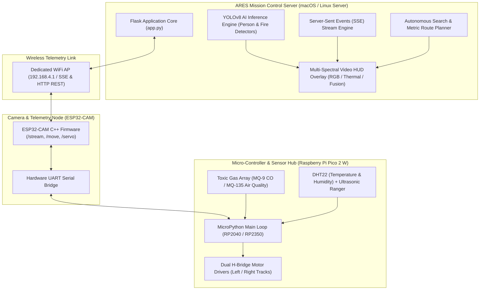

<div align="center">

# ARES — Autonomous Rescue & Emergency System (UGV Ground Vehicle Operations)

[](https://www.python.org/)
[](https://flask.palletsprojects.org/)
[](https://docs.ultralytics.com/)
[](https://opencv.org/)
[](https://www.raspberrypi.com/)
[](tests/)
[](LICENSE)

<p align="center">
  A mission-critical Unmanned Ground Vehicle (UGV) telemetry and autonomous exploration platform engineered for <b>disaster response</b>, <b>victim localization</b>, <b>toxic gas tracking</b>, and <b>thermal hazard monitoring</b> via dual edge microcontrollers and real-time computer vision.
</p>

</div>

---

## Table of Contents
- [Overview](#overview)
- [System Architecture](#system-architecture)
- [Core Engineering Features](#core-engineering-features)
- [Multi-Tier Hardware Topology](#multi-tier-hardware-topology)
- [Repository Layout](#repository-layout)
- [Quick Start & Installation Guide](#quick-start--installation-guide)
- [API Endpoints Reference](#api-endpoints-reference)
- [Running Automated Unit Tests](#running-automated-unit-tests)
- [Author & License](#author--license)

---

## Overview

**ARES (Autonomous Rescue & Emergency System)** is a full-stack cyber-physical platform designed for hazardous search-and-rescue operations. In post-disaster environments where human entry poses lethal risks, ARES deploys an autonomous robotic ground vehicle equipped with edge computer vision models (YOLOv8), environmental telemetry arrays (toxic gases, temperature, humidity), and multi-spectral video fusion to locate survivors and map structural threats.

---

## System Architecture



---

## Core Engineering Features

### 1. Autonomous AI Search Engine (`/ai-objectives`)
- **Fixed-Pattern Search Loop:** Executes coordinated movement cycles: advances 1 second forward (`'w'`), scans camera Left (135°) & Right (45°) for 2 seconds each, turns Right 0.5s (`'d'`), pauses 3 seconds to gather environmental sensor readings, and repeats.
- **Vision Target Lock:** Integrates dual YOLOv8 detectors for human victim detection and open flame detection. Immediately dispatches an emergency halt (`'x'`), centers the dual-axis servo camera (90°, 30°), and generates auditory/visual alarms for operators.
- **Environmental Threshold Halts:** Automatically halts the UGV upon encountering toxic gas concentrations (MQ-9 > 30 PPM / MQ-135 > 300 PPM) or extreme thermal anomalies (DHT22 ≥ 50°C).

### 2. Keypress-Emulated Route Planner (`/planned-routes`)
- **Metric-to-Time Translation:** Converts operator waypoints into millisecond-accurate motor commands (`1 meter = 1 second` linear movement, `0.5 seconds` 90-degree pivots).
- **Asynchronous Burst-Stop Protocol:** Dispatches directional signals (`'w'`, `'a'`, `'s'`, `'d'`) paired with redundant burst-stop frames (`'x'`) to ensure the vehicle safely terminates motion in the event of packet loss or signal drops.

### 3. Multi-Spectral Vision & Live Telemetry Stream (`/dashboard`)
- **Spectral Overlays:** Real-time software rendering across Normal RGB, Thermal Simulation, Infrared NoIR, and Multi-Sensor Fusion modes with heads-up display (HUD) coordinates.
- **Real-Time Feed Default:** Automatically transitions operator viewport to live hardware camera feeds upon mission launch.
- **Visual Breadcrumb Tracker:** 2D coordinate tracker mapping real-time UGV trajectory, yaw angles, and waypoint history.

### 4. Enterprise Security & Audit Infrastructure
- **Role-Based Access Control (RBAC):** Enforces granular permissions across Administrator, Operator, and Field Auditor tiers.
- **Mission Auditing & Forensic Reports:** SQLite database logging all mission telemetry, anomaly timestamps, and automated PDF/HTML executive report generators.

---

## Multi-Tier Hardware Topology

| Component | Hardware Specification | Role in ARES Architecture |
| :--- | :--- | :--- |
| **Video & Camera Node** | ESP32-CAM (OV2640 / 2.4 GHz WiFi) | RTSP/MJPEG Video Streaming & HTTP Command Gateway |
| **Motor & Sensor Controller** | Raspberry Pi Pico 2 W (RP2350) | Real-time PWM Motor Control, Sensor Polling, UART Relay |
| **Toxic Gas Array** | MQ-9 & MQ-135 Sensors | Carbon Monoxide (CO), Combustible Gas & Air Quality Monitoring |
| **Climate & Proximity** | DHT22 & HC-SR04 | Ambient Temperature, Humidity, and Obstacle Avoidance |
| **Pan/Tilt Servos** | Dual SG90 Micro Servos | 180° Horizontal Pan / 90° Vertical Tilt Camera Gimbal |

---

## Repository Layout

```
ARES/
├── app.py                           # Mission Control Production Server Entry
├── config.py                        # Centralized Configuration & Constants
├── start_ares.sh                    # Unified Shell Launcher (macOS / Linux)
├── start_ares.command               # One-Click macOS Desktop App Launcher
├── requirements.txt                 # Python Dependencies Specification
├── yolov8n.pt                       # Pre-Trained YOLOv8 Object Detection Weights
├── yolov8n_fire.pt                  # Specialized YOLOv8 Fire Classification Weights
├── ares_app/                        # Modular Application Core
│   ├── database.py                  # SQLite Mission Log & User Manager
│   ├── hardware/                    # ESP32-CAM & Pico Hardware Drivers
│   ├── reports/                     # PDF & HTML Report Generator Engine
│   ├── routes/                      # Blueprint HTTP API & SSE Handlers
│   ├── security/                    # RBAC Auth & Security Audit Logging
│   ├── telemetry/                   # Telemetry Calculation & SSE Stream Engine
│   ├── ugv/                         # Route Planner & AI Objective Search Threads
│   ├── utils/                       # Network IP Discovery & SSL Management
│   └── vision/                      # YOLOv8 Detector & Multi-Spectral Mutators
├── ARES Hardware System/            # Hardware Micro-Code & Firmware Source
│   ├── ESP 32 Cam/                  # ESP32-CAM C++ Firmware Source
│   │   └── CameraWebServe/          # Arduino / PlatformIO Camera Server
│   ├── Raspberry Pi Pico 2 W/       # MicroPython Pico 2 W Hardware Loop
│   │   └── main.py
│   └── Interface/                   # Hardware Pin Maps & Technical Manuals
├── templates/                       # Glassmorphism UI Templates
│   ├── dashboard.html               # Main Operations Hub & Telemetry Canvas
│   ├── ai_objectives.html           # Autonomous AI Objective Selector
│   ├── planned_routes.html          # Custom Route Planner UI
│   ├── hardware_control.html        # Manual Teleoperation Interface
│   └── admin_settings.html          # System Security & User Management
└── tests/                           # Automated Unit Test Suite (22 Tests)
```

---

## Quick Start & Installation Guide

### Prerequisites
- Python 3.10 or higher
- Git
- OpenCV and PyTorch compatible hardware (Apple Silicon / CUDA / x86_64 CPU)

### 1. Clone & Set Up Environment

```bash
# Clone repository
git clone https://github.com/a360n/ARES.git
cd ARES

# Create virtual environment
python3 -m venv venv

# Activate virtual environment
source venv/bin/activate

# Install dependencies
pip install -r requirements.txt
```

### 2. Launch Mission Control Server

```bash
# On macOS / Linux:
./start_ares.sh

# Or run directly:
python3 app.py
```

Open your browser and navigate to:
- **Local Control Hub:** `https://127.0.0.1:5001`
- **Default Credentials:**
  - **Username:** `admin`
  - **Password:** `admin123`

---

## API Endpoints Reference

| Category | Endpoint | Method | Description |
| :--- | :--- | :--- | :--- |
| **Telemetry** | `/api/telemetry/stream` | `GET` | Real-time Server-Sent Events (SSE) telemetry feed |
| **Hardware** | `/api/hardware/manual_control` | `POST` | Dispatches manual WASD driving commands |
| **Hardware** | `/api/hardware/set_dashboard_mode` | `POST` | Switches between `simulation` and `realtime` feed modes |
| **Route Execution**| `/api/ugv/routes/launch` | `POST` | Launches planned metric route thread |
| **Route Execution**| `/api/ugv/routes/cancel` | `POST` | Emergency halts active planned route thread |
| **AI Objectives** | `/api/ugv/ai/launch` | `POST` | Launches autonomous vision AI search thread |
| **AI Objectives** | `/api/ugv/ai/cancel` | `POST` | Emergency halts active AI search thread |

---

## Running Automated Unit Tests

ARES includes a complete unit test suite validating database connectivity, RBAC security, telemetry calculation engines, and vision inference pipelines:

```bash
python3 -m unittest discover tests
```

---

## Author

**Ali Nasser (Ali Al-Khazali)**
- Portfolio: [www.ali-nasser.dev](https://www.ali-nasser.dev)
- GitHub: [@a360n](https://github.com/a360n)
- LinkedIn: [Ali Nasser](https://www.linkedin.com/in/ali-nasser-dev/)

---

## License

This project is licensed under the MIT License — see the [LICENSE](LICENSE) file for details.
